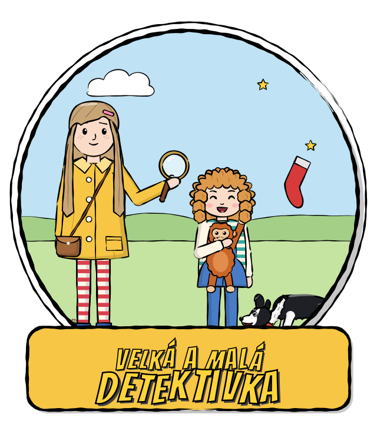
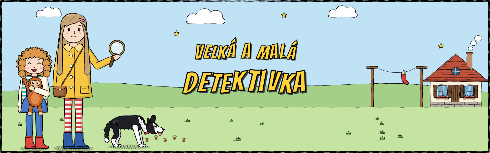

<p align="center">
  
</p>

<h3 align="center">Comics and a point-and-click game, made at home for two small detectives</h3>

<p align="center">
  
  
  
  
</p>

---

This repo is a family project. It holds printed comics and a matching point-and-click game for two
sisters, a big one and a little one. They solve gentle mysteries at their grandparents' cottage, with
a magnifier, a torch, a plush orangutan and a very clever border collie.

The goal is to get kids comfortable on a computer through play: read the comic at bedtime, then
play the same story the next day.

<p align="center">
  
</p>

## 📚 What's inside

| | |
|---|---|
| 🖍️ **Comics** | Hand-inked, printable issues (A4 plus an A5 fold-and-staple booklet). See [`comics/`](comics/). |
| 🎮 **Game** | A Godot point-and-click adventure where every comic issue becomes a playable story. See [`game/`](game/). |
| ✏️ **Art** | All art is **drawn in Python code**, the same library for the comic and the game. See [`art/`](art/). |
| 🗺️ **Plans** | The series plan, the game design and the comic workflow. See [`docs/`](docs/). |

## 🔍 The stories

**Series 1: Velká a malá detektivka** has 16 issues, running from autumn to the next summer. A thread
connects them: grandpa's childhood club, *Klub Hvězdička*.

| # | Story | Comic | Game |
|---|---|:---:|:---:|
| 1 | Záhada zmizelých ponožek (The Mystery of the Missing Socks) | ✅ | 🚧 |
| 2 | Tajemství starého klíče (The Secret of the Old Key) | ✅ | ⏳ |
| 3–16 | …Mapa ke starému rybníku, Stopy ve sněhu, Noc padajících hvězd… | ⏳ | ⏳ |

Full plan: [`docs/series-plan.md`](docs/series-plan.md).

## 🧸 Made for small hands

- **One click does the obvious thing.** No verb menus. Big hotspots with a hand cursor.
- **Nothing scary, no fail states, no timers.** Every "culprit" turns out to be an animal or a kind person.
- **Stuck? Click the dog.** He sniffs, walks towards the next goal and says *"Čmuch čmuch!"*
- **Both sisters are playable.** Some puzzles need the small one, because only she fits through the fence.
- **Czech and English**, with big hand-lettered subtitles so a grown-up can read along.
- **Saves itself** on every room change.

## 🚀 Run it

You need the portable **Godot 4.6.3** (Popochiu doesn't support 4.7 yet):

```sh
~/apps/godot-4.6/Godot_v4.6.3-stable_linux.x86_64 --path game       # play
~/apps/godot-4.6/Godot_v4.6.3-stable_linux.x86_64 -e --path game    # editor
```

Redraw the art (colour for the game, greyscale for the printer):

```sh
cd art && python -m venv .venv && .venv/bin/pip install -r requirements.txt
.venv/bin/python export_assets.py              # game PNGs -> game/assets/
.venv/bin/python comic_issue1.py               # comic PDF -> comics/
.venv/bin/python readme_art.py                 # this page's logo + banner -> docs/img/
```

Details on the tech, the repo layout and the conventions are in [`CLAUDE.md`](CLAUDE.md).

## © Licence

**All rights reserved.** This is a private family project, shared here for safekeeping and not for reuse.
See [`LICENSE`](LICENSE). Third-party parts keep their own licences: Popochiu (MIT) and the fonts (SIL OFL 1.1).

---

<p align="center"><sub>Made with ❤️, a magnifier and a lot of missing socks.</sub></p>
